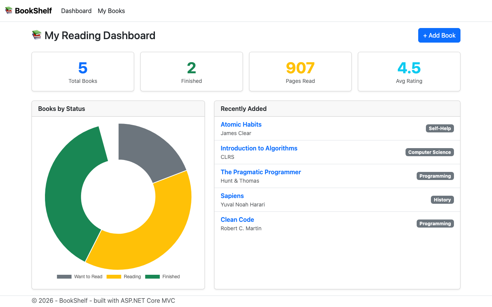
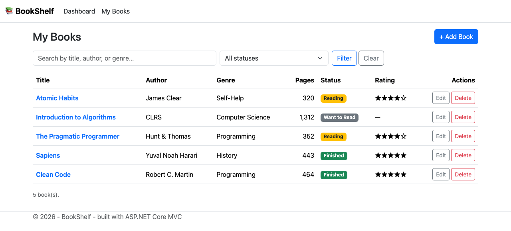

# BookShelf — ASP.NET Core MVC

<p align="left">
  
  
  
  
  
</p>


A small **reading tracker** web app by **Joe Habre (AUB)** — built with **ASP.NET Core MVC**, **Entity Framework Core**, and a **Bootstrap** front end.

Add books to your shelf, track whether you want to read / are reading / have finished them, rate them, and see your reading stats on a dashboard with a live chart.

---

## Screenshots

**Dashboard** — reading stats, a status breakdown chart, and recently added books:



**My Books** — the full library with search, status filtering, and inline actions:



---

## Features

| Feature | Details |
|---|---|
| **Dashboard** | Total books, finished count, pages read, and average rating at a glance |
| **Status chart** | A Chart.js doughnut showing books by reading status |
| **Full CRUD** | Create, view, edit, and delete books — proper MVC controllers and views |
| **Search & filter** | Case-insensitive search by title, author, or genre; filter by status |
| **Validation** | Server- and client-side validation via data annotations |
| **Database** | EF Core with SQLite; schema and seed data created automatically on first run |
| **Responsive UI** | Bootstrap 5 layout that works on mobile and desktop |

---

## Tech Stack

- **ASP.NET Core MVC** (.NET 10) — controllers, views, Razor, tag helpers
- **Entity Framework Core** + **SQLite** — data access, LINQ queries, seeding
- **Bootstrap 5** — responsive styling
- **Chart.js** — the dashboard status chart
- **Data annotations** — model validation

---

## Architecture

```
BookShelf-MVC/
├── Controllers/
│   ├── HomeController.cs      # Dashboard with reading stats
│   └── BooksController.cs     # CRUD + search/filter
├── Models/
│   ├── Book.cs                # Entity + ReadingStatus enum + validation
│   └── DashboardViewModel.cs  # Aggregated stats for the dashboard
├── Data/
│   └── BookShelfContext.cs    # EF Core DbContext + seed data
├── Views/
│   ├── Home/Index.cshtml      # Dashboard
│   └── Books/                 # Index, Create, Edit, Details, Delete
├── wwwroot/js/dashboard.js    # Chart.js doughnut
└── Program.cs                 # DI, EF Core registration, DB bootstrap
```

The app follows the standard MVC separation: controllers stay thin and delegate
data access to the EF Core context, views are strongly typed to models, and the
dashboard uses a dedicated view model rather than passing raw entities.

---

## Quick Start

**Requirements:** [.NET 10 SDK](https://dotnet.microsoft.com/download)

```bash
git clone https://github.com/Joeehabre/BookShelf-MVC.git
cd BookShelf-MVC
dotnet run
```

Then open the URL shown in the console (e.g. `http://localhost:5239`).
The SQLite database is created and seeded automatically on first run — no setup needed.

---

## What I Learned

- Building a full MVC app end to end — routing, controllers, strongly typed views, tag helpers
- Entity Framework Core: `DbContext`, LINQ queries, seeding, and SQLite migrations-free bootstrap
- Separating concerns with a view model for aggregated dashboard data
- Model validation with data annotations on both server and client
- Wiring a JavaScript chart to server-rendered data

---

## License

[MIT](LICENSE)
